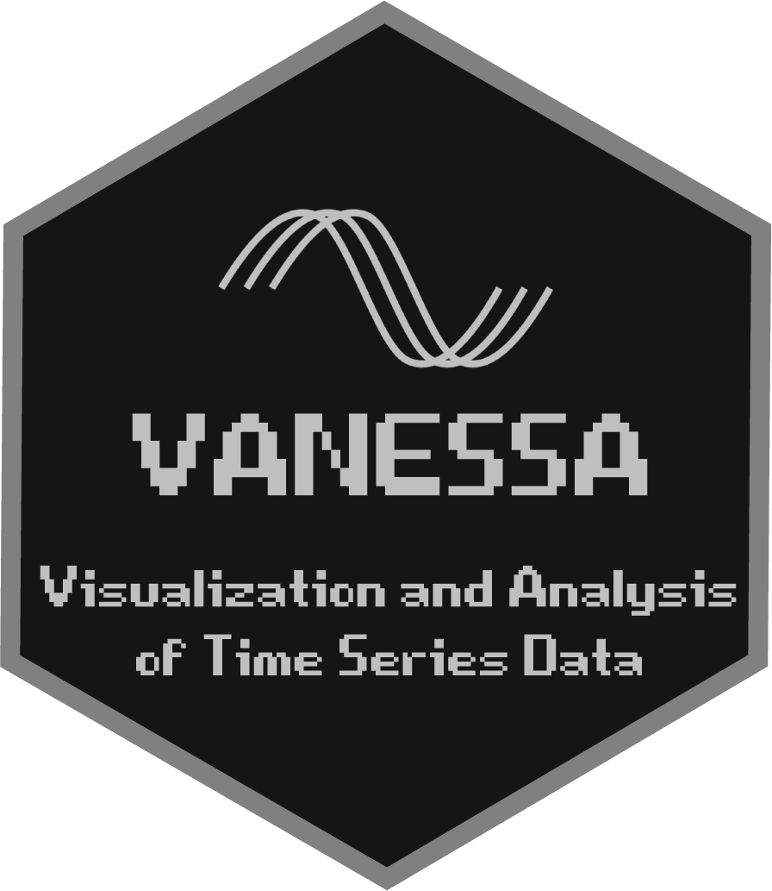

# VANESSA-DAM&nbsp;&nbsp;&nbsp;&nbsp;&nbsp;&nbsp;&nbsp;&nbsp;&nbsp;&nbsp;&nbsp;&nbsp;&nbsp;&nbsp;&nbsp;&nbsp;&nbsp;&nbsp;&nbsp;&nbsp;&nbsp;&nbsp;&nbsp;&nbsp;&nbsp;&nbsp;&nbsp;&nbsp;&nbsp;&nbsp;&nbsp;&nbsp;&nbsp;&nbsp;&nbsp;&nbsp;&nbsp;&nbsp;&nbsp;&nbsp;&nbsp;&nbsp;&nbsp;&nbsp;&nbsp;&nbsp;&nbsp;&nbsp;
 [](https://zenodo.org/badge/latestdoi/326950938)&nbsp;
**V**isualization and **AN**alysis of tim**E** **S**erie**S** d**A**ta - **D**rosophila **A**ctivity **M**onitors (**VANESSA-DAM**) is a collection of useful tools to visualize and analyze Time series data obtained from Drosophila Activity Monitors (https://www.trikinetics.com/). The first in the series of tools are two shiny apps for circadian rhythm and sleep analysis and visualization - VANESSA-DAM for circadian rhythm analysis (**VANESSA-DAM-CRA**) and sleep analysis (**VANESSA-DAM-SA**). For any suggestions, questions, troubleshooting or customization, please contact arijitghosh2009@gmail.com. The contents of this repository undergoes signifcant changes at least once a year, and versions with significant changes are archived on Zenodo. Click on [this](https://github.com/orijitghosh/VANESSA-DAM/archive/refs/heads/main.zip) link to download the apps in a zipped file.

## Citation:
Please cite as *Ghosh, A. and Sheeba, V. (2022) ‘VANESSA—Shiny Apps for Accelerated Time-series Analysis and Visualization of Drosophila Circadian Rhythm and Sleep Data’, Journal of Biological Rhythms. doi: 10.1177/07487304221077662.*
#### The apps are also hosted on shinyapps.io server. Access VANESSA-DAM-CRA at https://cryptodice.shinyapps.io/vanessa-dam-cra/ and VANESSA-DAM-SA at https://cryptodice.shinyapps.io/vanessa-dam-sa/. However, currently the apps are hosted on a free-tier account which restricts monthly usage to 25 hours. So, users familiar with R and RStudio should use the R packages for using the apps locally.

#### Tutorials are available as PDF files from respecive app's folder on GitHub, and from the Documentation tab of the apps. The Wiki page on GitHub hosts some good practices for data analysis. Novice users can directly use the ```vanessadamcra``` and ```vanessadamsa``` packages to avoid installing packages and running the apps from RStudio R console.

## Install the packages for VANESSA-DAM-CRA and VANESSA-DAM-SA by using the following commands in your RStudio R console:
```
if (!require("remotes")) install.packages("remotes")
remotes::install_github("orijitghosh/VANESSA-DAM", subdir = "VANESSA-DAM-CRA/vanessadamcra")
remotes::install_github("orijitghosh/VANESSA-DAM", subdir = "VANESSA-DAM-SA/vanessadamsa")
```
Then run the apps by using
```
library(vanessadamcra)
runVanessaDamCra()
library(vanessadamsa)
runVanessaDamSa()
```

## Please follow the tutorial once successfully before using your own data.

### **VANESSA-DAM-CRA**

VANESSA-DAM-CRA is dependent on [Quentin Geissmann](https://github.com/qgeissmann)'s [rethomics](https://github.com/rethomics) family of packages - [behavr](https://github.com/rethomics/behavr), [damr](https://github.com/rethomics/damr), [ggetho](https://github.com/rethomics/ggetho), [zeitgebr](https://github.com/rethomics/zeitgebr), for some analysis and visualization options. It offers several advantages over existing tools for circadian rhythm analysis from DAM systems, some mentionable ones are - 

1. Analysis and visualization of multiple monitor files, genotypes, replicates together in a high-throughput manner.

2. Automatic period power detection through a range of periodogram methods.

3. Producing high-resolution publication-quality figures with a plethora of customization.

4. Data curation - automatic user-defined parameter based deletion of dead and arrhythmic individuals.

5. Individual wise CWT spectrograms.

6. Visual comparison among genotypes, replicates.

7. Timeseries filtering with kernel smoothing and Butterworth filters.

8. Reproducible code report so that you can generate the figures and analysis without the shiny app from RStudio directly.

9. Minimizing human errors – no need to tinker with raw data to accommodate analysis tools.

10. Creating metadata files for information about experiment and better reproducibility.

A short tutorial is provided (*Easy tutorial to start using VANESSA-DAM-CRA.pdf*) which is self explanatory and should help beginners start using the app right away.

### **VANESSA-DAM-SA**

VANESSA-DAM-SA is dependent on [Quentin Geissmann](https://github.com/qgeissmann)'s [rethomics](https://github.com/rethomics) family of packages - [behavr](https://github.com/rethomics/behavr), [damr](https://github.com/rethomics/damr), [ggetho](https://github.com/rethomics/ggetho), [sleepr](https://github.com/rethomics/sleepr), for some analysis and visualization options. It offers several advantages over existing tools for sleep analysis from DAM systems, some mentionable ones are - 

1. Analysis and visualization of multiple monitor files, genotypes, replicates together in a high-throughput manner.

2. Creating metadata files for information about experiment and better reproducibility.

3. Producing high-resolution publication-quality figures with a plethora of customization.

4. Data curation - automatic user-defined parameter based deletion of dead and arrhythmic individuals.

5. Sleep profile analysis, various sleep parameter estimation and quantification, bout analysis, latency analysis.

6. Visual comparison among genotypes, replicates.

7. Dynamic plot resizing and recoloring.

8. Reproducible code report so that you can generate the figures and analysis without the shiny app from RStudio directly.

9. Minimizing human errors – no need to tinker with raw data to accommodate analysis tools.

A short tutorial is provided (*Easy tutorial to start using VANESSA-DAM-SA.pdf*) which is self explanatory and should help beginners start using the app right away.

### Troubleshooting:
1. Sometimes due to different settings in one's RStudio, packages may have been loaded in R when RStudio is initialized. These loaded packages may mask certain functions from the packages needed by VANESSA-DAM to work properly. To avoid this, please restart R and clear the global environment in RStudio by pressing **ctl+shift+F10** or by clicking on **Session > Restart R** from RStudio menu.
2. If your local R installation language settings are other than **_English_**, please set local language as **_English_** before starting the apps by running this command: ```Sys.setlocale("LC_ALL","English")```.
